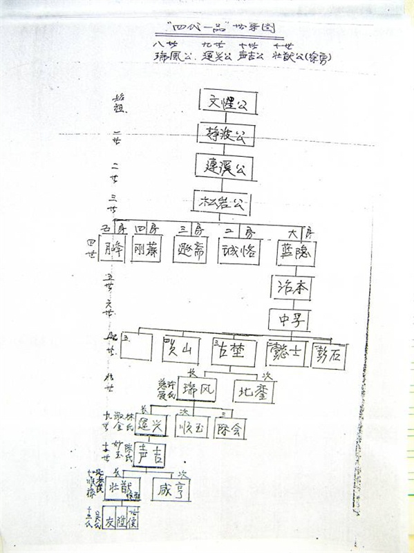
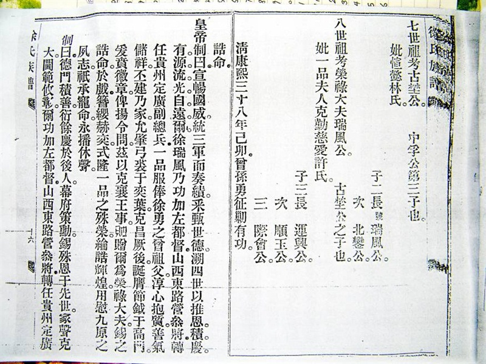
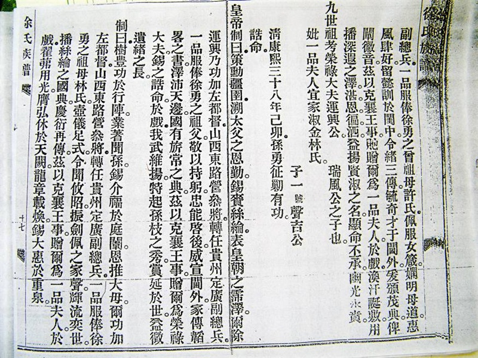
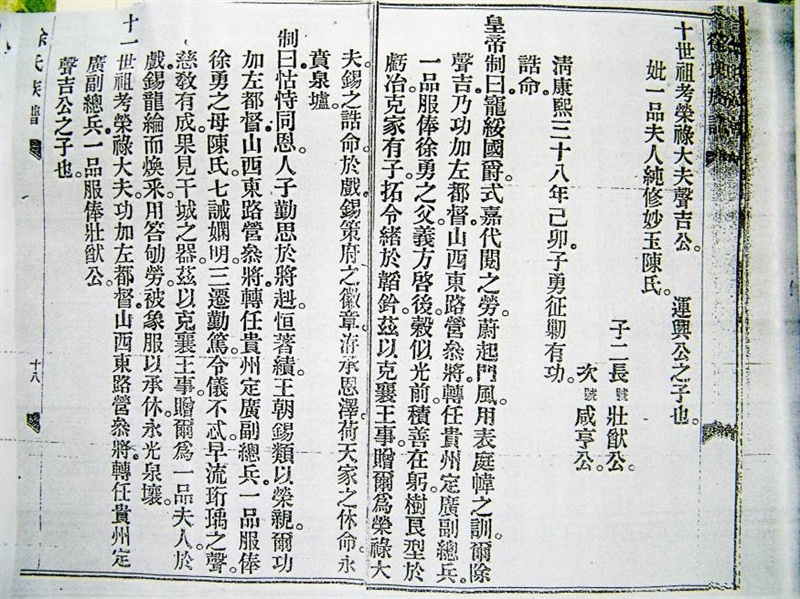
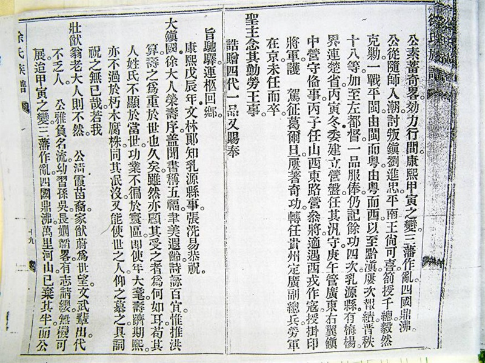
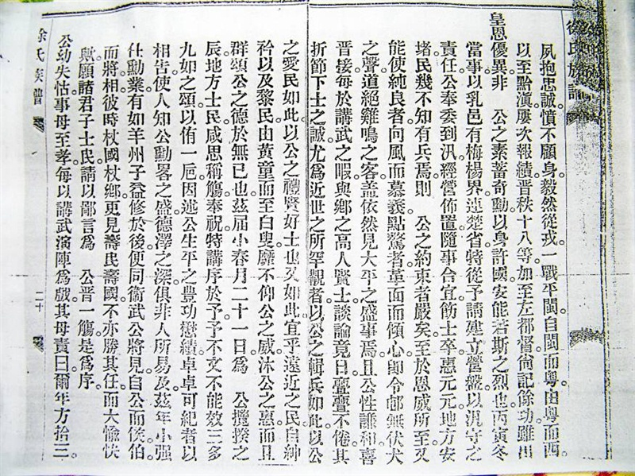
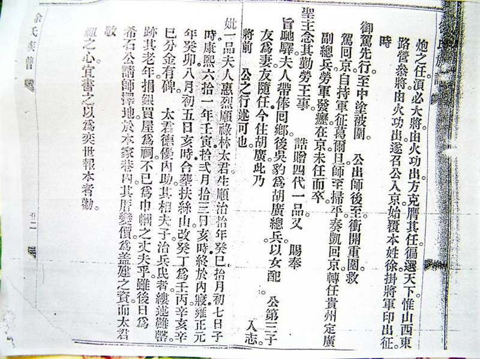

## 徐 Xu

**序言**

未有先知。

**目录**

[TOC]

**正文**

### 一、姓氏起源

徐氏入潮始于南宋，潮阳有徐姓人氏，始于南宋庆元年间。

福建漳州府北桥萧洵，字仲川，号启祥，南宋庆元年间（1195）出任潮阳县令。其外甥徐静波随舅萧洵出任潮阳县师爷，四任十二年。开禧三年（1207）任满，舅、甥拟归故里。由于舅、甥在任期间清廉勤政，体恤民情，多行善举，县民感其德而恳切挽留，故二人授民意而定居于潮。潮阳始有萧、徐姓氏。舅、甥二人为报民爱，将县民褒扬萧洵业绩所建生祠改为乡校，并连手致力培育人才，使潮阳学子英才辈出，硕果累累。

时元兵侵潮，静波支持洵公孙衔疾集众抗元，因积劳成疾，于已卯年（1279）卒。静波有四子。次子定居于揭阳，三子定居于海丰，四子皆有文士之风。长子连溪，幼有大志，胸藏韬略，继承先人之志，从戎抗元。时任抗元“指挥使”。与敌激战于赤寮、铜孟等地。后因朝庭抗元兵败，遭元兵追逐。为避元兵诛戮追杀，举家迁隐达濠（现隶属濠江区青篮乡，达濠徐氏由此开始），闭门教授子弟周礼、四书、五经等。次子回福建后迁徙潮州。长子松岩，又名希文，字梦凤。幼聪颖，秉承家训、坚持操守、克承先志、克缵先猷。明正统初赐进士，授广西南宁宣化知事。岁歉，他因赈饥有功，被特授“荣禄大夫”。后转任福州，因不与当政者同流合污，隐退故里。正统十四年五月卒，葬于蛇孔山，即现在濠江区赤隆辖区徐厝埔。

从徐静波来潮迄今共785年，传三十世。裔孙遍布广东汕头、白石、凤鸣、丰顺、梅州、蕉岭、饶平、海丰、陆丰、靖海、增城和福建、港澳台等地区，国外则有美国、加拿大、越南等国家，人口逾十万之众，世代簪缨贤人辈出。

清朝康熙初年，裔孙壮猷随康熙帝出征云南平吴三桂之乱有功，被授“荣禄大夫”功加左都督、湖广总兵，正一品职并诰赠上三代一品。故达濠徐氏有“特授荣禄大夫”功加左都督、湖广总兵，四代一品之美称。明朝进士有：徐天叶、徐日焕、徐庆余、徐志道、徐冽、徐宗敬；举人有：徐义、徐尚卿、徐建新；清朝还有台湾总兵徐奕表、福建和平知事徐悦吾、峨眉县令徐上（平山）、福建诏安典史等。还有曾任中共福州地委书记、牺牲于1927年的革命烈士——徐琛及夫人哲贞。几百年来，各地包括海外子孙无不缅怀先祖，联合海外族亲报效家乡不遗余力！徐氏世代为国家兴旺，潮汕繁荣做出了积极贡献。

### 二、名字派文

青篮徐氏惇叙堂派字文，完全按《易经》卦式编辑。名和字都有派字。用三十二字，以象三十二阳卦，为名之派字；又用三十二字，以象三十二阴卦，为字之派字。阳阴两卦合计六十四字，以象上下二经六十四卦；每句用四字，以《易经》之“元、亨、利、贞”，取四序流衍之意。

```
# 男名派文
振光昱茂，笃庆兴隆，英奇发秀，御殿钦崇，王朝嘉伟，邦国豪雄，良辅贤弼，永锡益丰
```

```
# 男字派文
缵扬盛烈，正大长绵，允逢景祚，克继乃先，经伦济美，道德昭宣，协祥应兆，作述相传
```

```
# 女名派文
淑惠爱勤，顺受欢欣，治家惟俭，敦睦脩仁，雍容端敬，和洽孝亲，贞诚集瑞，福禄咸臻
```

上述三篇派字文，独具匠心，不仅格式按《易经》卦式编写，而且用平声字押韵，语句流畅，内涵丰富，男女特征突出。

### 三、世系血脉

世系图，如下：



正文。

### 四、四代一品

正文。 














正文。

### 五、田心旧事

青篮村位于濠江区政府东南1公里左右，西北隔赤港坑与赤港村相接，东倚大瞭望山，西南临濠江，交通便利，渔盐工商繁荣，自明代以来就是海上贸易的重要据点。据《汕头市达濠区地名志》介绍，早在宋元时期，先后有詹、茆、何、纪等姓氏到这里定居，原先这一带是青葱树林，遂称“青林”，后来逐渐繁衍成一村落。明隆庆《潮阳县志》已有“青林”的记载，直到1966年才将青林改为青篮。

青篮这个小地方，曾经出过一个大官——徐勇。光绪《潮阳县志》记载，“徐勇，青篮人，官定协副将加左都督。”青篮徐氏惇叙堂中有一块纪念徐勇军旅战功的匾额，上书“四代一品”，至今传为佳话。《青篮徐氏谱》介绍：徐勇在康熙年间屡立战功，曾救康熙皇帝于重重围困之中。皇帝念其勤王护驾有功，诰赠其祖上三代为“一品”，而徐勇自己也是一品，所以青篮徐氏就有“四代一品”之称。这个故事，现在青篮徐氏族人一提起，还是满满的自豪。

然而对于青篮乡来说，徐氏对村子的贡献却不仅限于此，他们更为外人称道的是，徐氏先祖重建了田心古庙。如今古庙之中还有“徐厝爹”“徐厝妈”受乡民供奉。

青篮田心古庙建于明崇祯年间，祭祀潮汕本土神明三山国王，因为当时四周都是田园，神庙刚好处于田园中心，所以被称为田心宫。由于明末社会动乱，地处滨海的青篮乡经常遭受海上武装集团的侵扰，社会治安极其混乱。如张礼、郑成功等相继占据达濠三寨，青篮饱受其害。之后明清鼎革，满清统治者实行了残酷的迁海斥地政策，田心宫也毁于战乱之中。

《青篮徐氏族谱》有这样一段记载，“康熙三年，迁沿海边民，斥入内地，坟墓抛弃，木主失遗，流离失所”。这种颠沛流离的生活状态一直持续了十几年，直到康熙十九年，清政府击败邱辉后，才重新开放海界，达濠百姓得以回乡。（康熙）“拾九年庚申，始复界外迁民。由是我族渐次移归青篮，或遗落木主，或失修坟基。”在生活重获安稳之后，康熙二十九年庚午，徐氏先祖荣万公率众重建田心古庙，置办香灯田产，岁时轮流奉祀，其后题刻匾额，增助夫人像，历经年岁，香火不断。

//所以有知，所以有晓

### 六、文章至末

正文。 